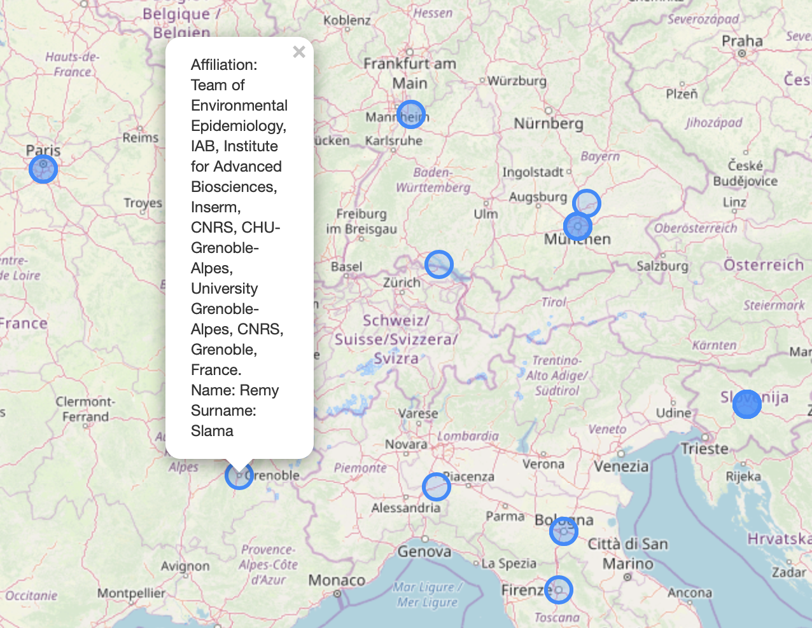
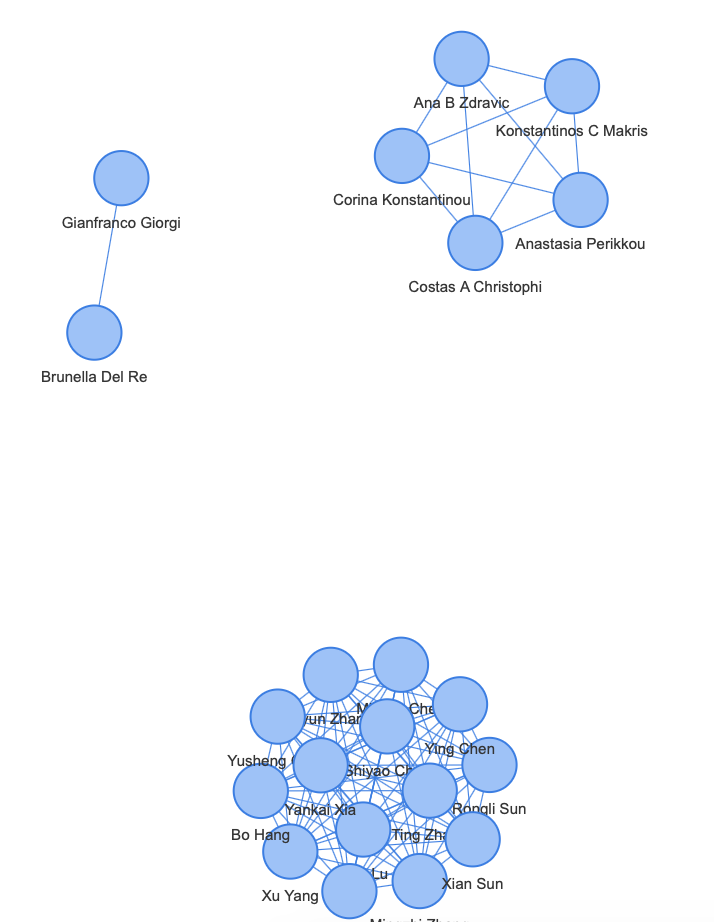

# academic-networks

This small Python *library* allows users to:

* Perform a search on PubMed based on a user-defined query, and generate maps and networks of the authors.
* Perform a search on PubMed based on a user-defined author, and generate maps and networks of the authors (**work in progress**).

The Python classes can be found in `utils.py`, whereas `examples.ipynb` contains some examples on how to use them.

The figures below show an example of such maps and networks, respectively.

